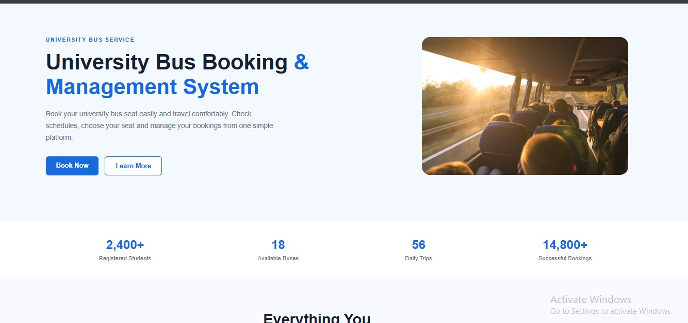
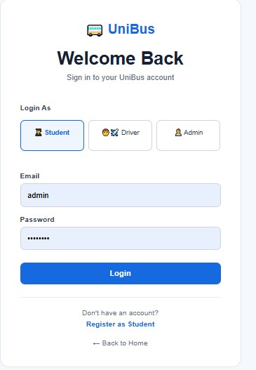
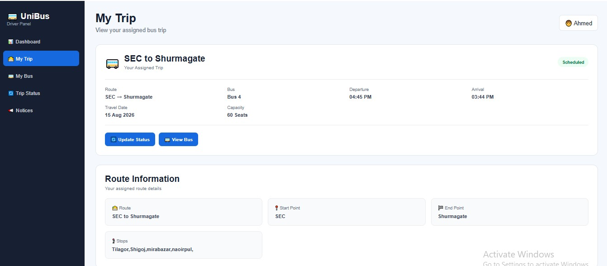

# 🚌 UniBus
## University Bus Booking and Management System

# UniBus – University Bus Booking System

🚍 **Live Website:** https://unibus-sec.infinityfreeapp.com/

> **Book Early. Ride Comfortably.**

UniBus is a web-based University Bus Booking and Management System designed to make university transportation easier, more organized, and more convenient for students.

The system allows students to check bus schedules, view available seats, reserve seats in advance, manage their bookings, and receive important transportation notices.

It also provides separate facilities for administrators and drivers to manage transportation-related activities efficiently.

---

## 📌 Project Overview

Students often face difficulties getting university bus seats, especially during busy hours. They may have to travel standing, wait for another bus, or even miss the bus because they do not know the current schedule or seat availability.

UniBus aims to solve these problems by providing an online platform where students can:

- View available university buses
- Check bus schedules
- Check seat availability
- Reserve a seat before departure
- View booking history
- Cancel bookings
- Receive transportation notices

The system also helps administrators manage students, buses, drivers, routes, schedules, and bookings from one centralized platform.

---

# 🎯 Objectives

The main objectives of UniBus are:

- Provide online university bus seat booking.
- Reduce overcrowding and standing passengers.
- Help students reserve seats before departure.
- Allow students to easily check bus schedules.
- Provide information about available seats.
- Reduce manual transportation management.
- Help administrators manage buses, routes, drivers, and students.
- Help drivers manage assigned trips and passenger information.
- Provide booking records and reports.
- Improve communication through notices and notifications.

---

# 👥 System Users

UniBus has three main types of users:

## 👨‍🎓 Student

Students can:

- Register an account
- Log in
- View bus schedules
- Search routes
- Check seat availability
- Select a seat
- Book a seat
- View booking history
- Cancel a booking
- View notices
- Manage their profile

---

## 👨‍💼 Administrator

Administrators can:

- Manage students
- Verify student accounts
- Manage drivers
- Manage buses
- Manage routes
- Manage schedules
- Manage bookings
- View transportation information
- Publish notices
- Generate reports
- Monitor overall system activities

---

## 🧑‍✈️ Driver

Drivers can:

- Log in
- View assigned bus
- View assigned trips
- View passenger information
- Check passenger count
- Update trip status
- Start a trip
- End a trip
- View today's schedule

---

# ⭐ Main Features

## 1. User Registration

Students can create an account by providing required information such as:

- Full Name
- Student ID
- Department
- Semester
- Phone Number
- Email
- Password

Student accounts can be verified by the administrator.

---

## 2. User Login

Users can securely log in according to their role:

- Student
- Driver
- Admin

After login, users are redirected to their respective dashboards.

---

## 3. Bus Schedule

Students can view available bus schedules.

Schedule information includes:

- Bus Number
- Route
- Departure Time
- Arrival Time
- Travel Date
- Available Seats
- Bus Status

---

## 4. Seat Booking

Students can select an available seat from a visual seat layout.

Seat statuses:

- 🟢 Available
- ⚫ Booked
- 🔵 Selected

After selecting a seat, the student can confirm the booking.

---

## 5. Booking Management

Students can view their bookings.

Booking information includes:

- Booking ID
- Bus
- Route
- Travel Date
- Seat Number
- Booking Status

Students can also cancel eligible bookings.

---

## 6. Student Dashboard

The student dashboard provides a quick overview of:

- Total Bookings
- Upcoming Trip
- Available Seats
- Recent Bookings
- Latest Notices

It also provides quick links to:

- Book Seat
- Bus Schedule
- My Bookings
- Profile

---

## 7. Admin Dashboard

The admin dashboard provides an overview of the complete transportation system.

It can display:

- Total Students
- Total Drivers
- Total Buses
- Total Bookings
- Active Routes
- Recent Bookings
- Student Verification Requests
- Bus Status

---

## 8. Driver Dashboard

The driver dashboard provides:

- Assigned Bus
- Today's Trip
- Passenger Count
- Passenger List
- Trip Status

Drivers can update the status of their assigned trips.

---

## 9. Notice Board

Administrators can publish important transportation notices.

Examples:

- Bus schedule changes
- Holiday announcements
- Route changes
- Bus maintenance information
- Emergency transportation notices

Students and drivers can view these notices.

---

## 10. Reports

The administration section can provide transportation-related reports such as:

- Booking reports
- Student information
- Bus usage
- Route information
- Trip information

---

# 🖥️ System Pages

## Public Pages

- Home
- About
- Contact
- Login
- Register
- Bus Schedule
- Notices

## Student Pages

- Student Dashboard
- Bus Schedule
- Seat Booking
- My Bookings
- Notices
- Profile

## Admin Pages

- Admin Dashboard
- Students
- Drivers
- Buses
- Routes
- Schedules
- Bookings
- Reports
- Notices

## Driver Pages

- Driver Dashboard
- Passenger List
- Today's Trips
- Trip Status

---

# 🎨 UI/UX Design

The UniBus interface follows a simple and modern university management system design.

### Brand

**Name:** UniBus

**Full Name:** University Bus Booking and Management System

**Tagline:**

> Book Early. Ride Comfortably.

### Design Principles

- Simple
- Clean
- Professional
- User-friendly
- Responsive
- Easy navigation
- Consistent components
- Accessible interface

### Main Theme

The design uses a professional university transportation theme with:

- Blue
- Green
- White
- Light gray
- Dark text

The interface uses cards, tables, buttons, forms, icons, and dashboards to provide a consistent user experience.

---

# 🛠️ Technologies Used

## Frontend

- HTML5
- CSS3
- Bootstrap 5
- JavaScript

## Backend

- PHP

## Database

- MySQL

## Development Environment

- XAMPP
- Visual Studio Code

## Design

- Figma

---

# 🗂️ Project Structure

```text
University-Bus-Booking-System/
│
├── admin/
│   ├── dashboard.php
│   ├── students.php
│   ├── drivers.php
│   ├── buses.php
│   ├── routes.php
│   ├── schedules.php
│   ├── bookings.php
│   ├── notices.php
│   └── reports.php
│
├── student/
│   ├── dashboard.php
│   ├── schedule.php
│   ├── book-seat.php
│   ├── my-bookings.php
│   ├── notices.php
│   └── profile.php
│
├── driver/
│   ├── dashboard.php
│   ├── passenger-list.php
│   └── trip-status.php
│
├── config/
│   └── database.php
│
├── database/
│   └── unibus.sql
│
├── css/
│   └── style.css
│
├── js/
│   └── script.js
│
├── images/
│
├── includes/
│
├── uploads/
│
├── index.php
├── login.php
├── register.php
├── about.php
├── contact.php
└── README.md


## Project Screenshots

### Homepage


### Login Page



### Student Dashboard


### Admin Dashboard


### Driver Dashboard

